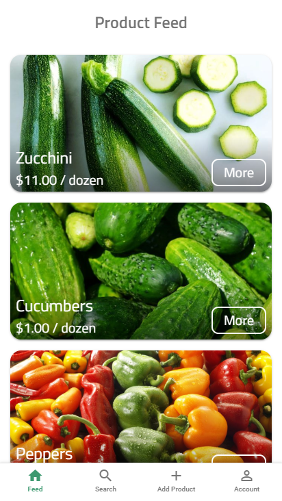
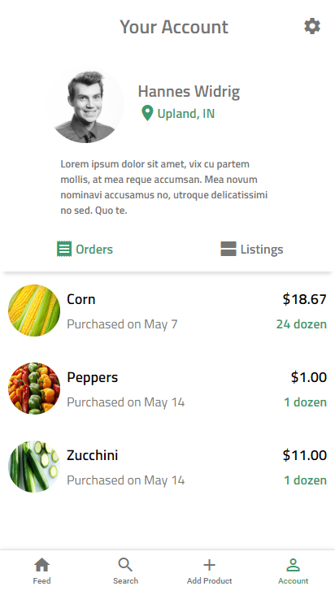

# Gardener's Exchange

### Your local connection to the freshest produce around.
This project was completed for Information Systems Design (ISD) in Spring 2018.
Developed by Hannes Widrig, Amish Mishra, Tim Ours, and Jon Meharg

## Searching

## Your Account

## TODO
### These are items that would be the next logical step in further developing this application.
Anything with :boom: next to it would be considered a critical improvement/update.
- :boom: Password hashing
- Edit/delete your account
- Edit/delete your listing
- View products within a certain radial proximity
- Reporting/flagging users
- Trading of items between users
- Improved desktop experience
- Improved history stack management with back button
- Improved account orders experience
- Improved account listings experience
- Notification system for application
- Chat system
- Payment system

## Running Gardener's Exchange
- Python 3.6.x or higher
- Based on Flask 0.12.2
- Required pip modules in `requirements.txt`